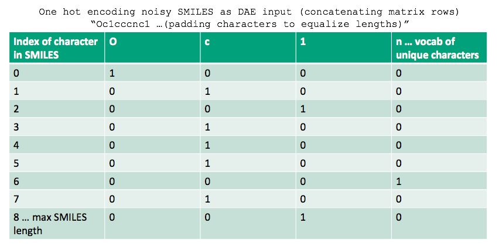
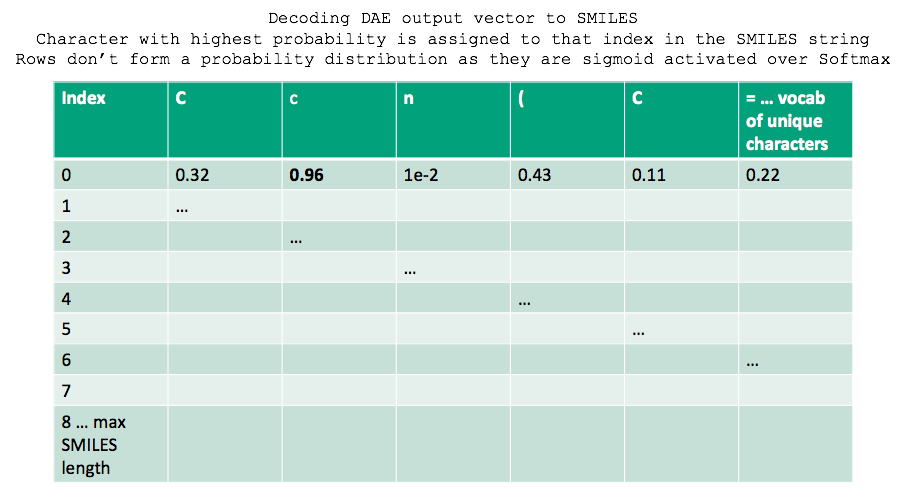

# Mol-Denoising-Autoencoder

De-noising Autoencoder implementation in TensorFlow 2.0 for de-noising chemically invalid SMILES strings to valid analogs (For analog generation/Post-processing generative models data) using one hot encoding for SMILES featurization

### Dependencies
[Numpy](https://anaconda.org/conda-forge/numpy)

[Pandas](https://anaconda.org/conda-forge/pandas)

[TensorFlow 2.0](https://www.tensorflow.org/install)

[RDKit](https://www.rdkit.org/docs/Install.html)


### Description
Generative models such as Variational Autoencoders and Restricted Boltzmann Machines used for generating molecular analogs rarely achieve perfect results in terms of the chemical validity of the generated molecules. This project is a first iteration exploration in using a Denoising Autoencoder for denoising such chemically invalid SMILES molecules into valid analogs - with potential use cases being a post-processing step for generative models and as a SMILES analog generating model in itself. 

### Featurization
This iteration of the DAE uses one hot encoding to feauturize noisy input SMILES strings and decode output vectors to SMILES, as illustrated below.



 

### Dataset

The original dataset is a subset of one of the [ChEMBL](https://www.ebi.ac.uk/chembl/) datasets of drug-like molecules. The noisy dataset was curated using a mixture of manual tuning (character displacement to structurally and chemically invalidate SMILES string) and the chemically invalid SMILES outputs of a generative model (RBM) - generated using originals as input seeds. 

### DAE example

```python
# Pick a noisy chemically invalid SMILES example
noisy_invalid_SMILES = smiles_noisy[1090]

noisy_invalid_SMILES
[out]: '=C(OO)CC1CCC(CC1)c2ccc(cc2)c3ccc4nc(cn4c3)C(=Nc5cc(F)c(F)c(F)c5)O'
```

```python
# Checking chemical validity of SMILES using rdkit function
dae_process.check_SMILES(noisy_invalid_SMILES)
[out]: False
```

```python
# Input noisy invalid SMILES sample to DAE
DAE_denoised_output_SMILES = DAE_Denoised_SMILES(noisy_invalid_SMILES)

DAE_denoised_output_SMILES
[out]: 'OC(=O)CC1CCC(CC1)c2ccc(cc2)c3ccc4nc(cn4c3)C(=Nc5cc(F)c(F)c(F)c5)O'
```

```python
# Check chemical validity of DAE output SMILES
dae_process.check_SMILES(DAE_denoised_output_SMILES)
[out]: True
```

### For training, create 'saved_nets' folder
```python
python Mol_DAE_train.py
```

